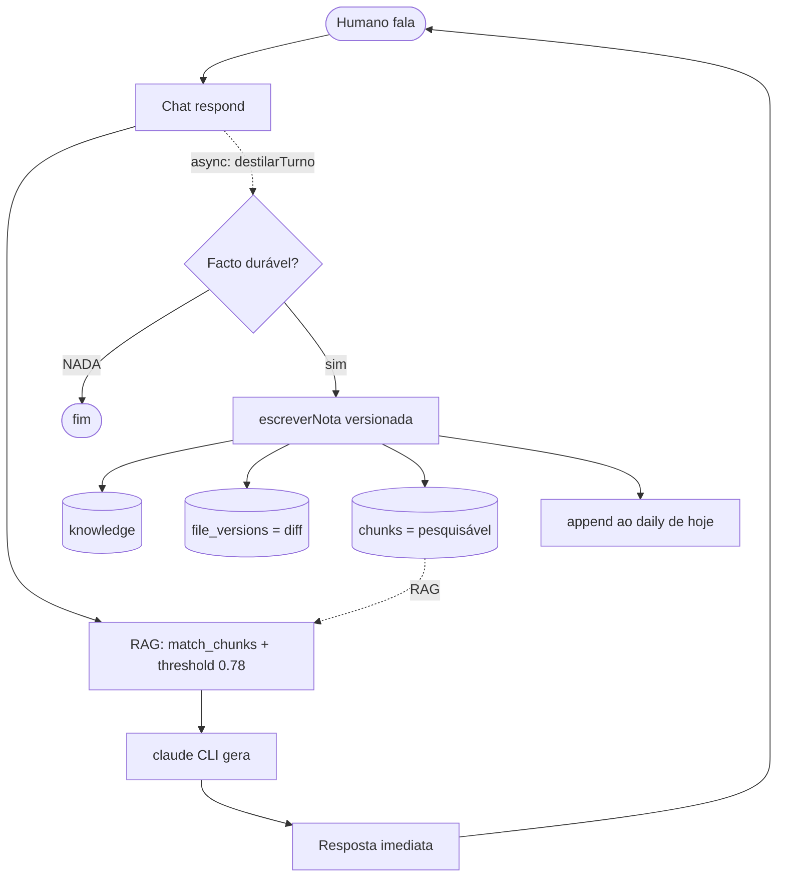
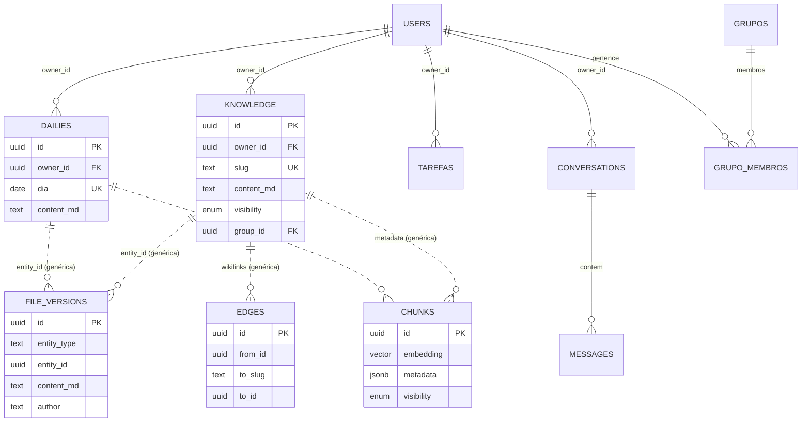
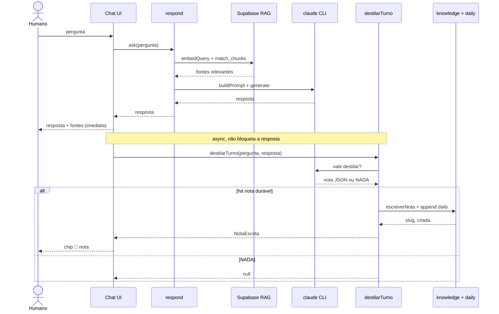

# Arquitetura — mem-vector

> **mem-vector** (codename) é um workspace **agente-autor** tipo-Obsidian: o humano fala, os agentes escrevem e mantêm o conhecimento (notas, dailies, tarefas). App web Next.js + Supabase. O fosso é a acumulação de contexto personalizado.

Este é o mapa de cima. Cada módulo tem o seu próprio doc detalhado em `src/modules/<nome>/README.md`.

## A tese (o loop)

```md
chat → o agente escreve estado tipado → fica pesquisável (RAG) → daily/notas refletem o trabalho
```

E a **rede de revisão**: cada escrita do agente grava uma versão → o utilizador vê o diff (o equivalente web ao `git diff`). É o que torna "o AI escreve os teus ficheiros" confiável.



## Stack

- **Next.js 16** (App Router, Server Components, server actions) — UI + porta de servidor.
    - **Leituras automáticas (useEffect) → rotas GET, não server actions (#73).** Os IDs das server actions rodam a cada HMR/build; um load automático num tab aberto fica com ID morto → "unexpected response". Reads chamados em `useEffect` usam `getJson` (`@/lib/api-get`) contra uma rota `GET /api/...` (URL estável). As actions ficam para escritas e para chamadas de clique.
- **Supabase local** — Postgres + **pgvector** (RAG) + **RLS** (isolamento) + Auth. Portas `560xx`.
- **Embeddings:** `multilingual-e5-small` local, CPU, via `@xenova/transformers` (384 dims; prefixos `passage:`/`query:`).
- **Geração:** `claude` CLI (subscrição), invocado por `@/lib/claude`.
- **Testes:** vitest (unit + integração RLS contra o Supabase local).

## Camadas

| Camada             | Onde                     | Responsabilidade                                                                                                                                                        |
| ------------------ | ------------------------ | ----------------------------------------------------------------------------------------------------------------------------------------------------------------------- |
| **App shell / UI** | `src/app/(app)/`         | Workspace de 2 colunas: **file explorer global** (`layout.tsx` + `components/layout/file-explorer.tsx`) + conteúdo (chat / ficheiro). Rotas protegidas pelo middleware. |
| **Módulos**        | `src/modules/<feature>/` | Arquitetura **por feature**: `schema` (Zod) + `service` (dados+regras) + `actions` (porta servidor, valida Zod) [+ UI].                                                 |
| **Lib partilhada** | `src/lib/`               | `supabase/` (server client + middleware), `embeddings` (e5-small), `claude` (`generate`).                                                                               |
| **Dados**          | `supabase/migrations/`   | Tabelas tipadas + genéricas + RLS + RPCs (`match_chunks`, `meus_grupos`).                                                                                               |

## Mapa dos módulos

| Módulo         | O que faz                                                                                                      | Doc                                           |
| -------------- | -------------------------------------------------------------------------------------------------------------- | --------------------------------------------- |
| **knowledge**  | O kernel de ficheiros — o agente escreve notas tipadas, versionadas, ligadas por `[[wikilinks]]`, pesquisáveis | [README](../src/modules/knowledge/README.md)  |
| **daily**      | Notas diárias — a destilação acumula o recap do dia                                                            | [README](../src/modules/daily/README.md)      |
| **chat**       | Pipeline RAG + a destilação proativa (assíncrona) que faz o agente escrever                                    | [README](../src/modules/chat/README.md)       |
| **tarefas**    | Tarefas do utilizador; o exemplo vivo do padrão feature-first                                                  | [README](../src/modules/tarefas/README.md)    |
| **projetos**   | Projetos reais — toda a tarefa ancora a um; "Pessoal" = projeto-vida                                           | [README](../src/modules/projetos/README.md)   |
| **definicoes** | Opções por utilizador (mega modal): método de destilação + módulos ativos                                      | [README](../src/modules/definicoes/README.md) |
| **grupos**     | Grupos de pares — a base da visibilidade `protected`                                                           | [README](../src/modules/grupos/README.md)     |
| **auth**       | Supabase Auth — a fundação do `auth.uid()` / RLS                                                               | [README](../src/modules/auth/README.md)       |

## Modelo de dados

A decisão central ([decisions/log](../../MythosEngine/decisions/log.md) 2026-06-02): **esquema TIPADO por natureza**, não uma tabela genérica. Aparência Obsidian na UI, espinha SaaS por baixo (validação forte, RLS limpo, migrations sãs).

**Tabelas tipadas (a espinha):**

- `knowledge` (notas), `dailies` (recaps por dia), `tarefas`
- `conversations` / `messages` (chat), `profiles`
- `grupos` / `grupo_membros` / `grupo_convites`

**Tabelas genéricas (infra transversal):**

- `file_versions` — trilha de auditoria (a **rede de revisão**); `entity_type` + `entity_id` → serve qualquer tipo (knowledge, daily).
- `edges` — wikilinks/grafo; liga uma linha a outra (`to_slug` resolve `to_id` quando o alvo existe).
- `chunks` — pgvector; a **pesquisa só corre aqui**. Cada chunk aponta o seu objeto via `metadata.entity_id`.

> Tipado para o domínio, genérico para a auditoria/grafo/pesquisa. Foi só no _conteúdo de domínio_ que o genérico era o erro.



> Linhas tracejadas = relações **lógicas** das tabelas genéricas (via `entity_type`+`entity_id` / `metadata`), não FKs reais. Linhas sólidas = FK real (`owner_id`, etc.).

## RLS (segurança)

Toda a tabela de domínio segue o mesmo padrão (de `auth`):

- **privado:** `owner_id = auth.uid()`
- **protected:** `visibility = 'protected' AND group_id IN (SELECT meus_grupos())`
- **apagar:** só o dono.

`meus_grupos()` é `SECURITY DEFINER` (`search_path=''`) para quebrar a recursão de RLS. Sem sessão (auth) não há `auth.uid()` → tudo depende do módulo `auth`.

## Fluxos-chave

**Agente-autor (o coração):**

```md
respond(pergunta) → embedQuery → match_chunks → threshold(0.78) → buildPrompt → claude → resposta JÁ
destilarTurno(...) → (async) o CLI decide se há nota durável → escreverNota (versionada) → append ao daily → chip "📝 nota"
```

A resposta não espera pela destilação (evita dobrar a latência).

**Escrita versionada (`escreverNota`/`acrescentarAoDaily`):**

```md
upsert (tipada) → file_version → re-gera chunks (pesquisa) → edges (wikilinks) → devolve diff
```

**Tarefas no kanban (#21):** a tabela `tarefas` anda pelo ciclo canónico
(`backlog → analise → desenvolvimento → testes → documentacao → terminado`),
com prioridade, tag de projeto livre, descrição e **dependência que bloqueia a
conclusão** (RPC `concluir_tarefa` valida; a conclusão — e só ela — escreve no
daily). O agente cria/conclui tarefas no pós-turno: o envelope one-shot ganhou
`"tarefas"` + `"concluir"` (com a lista de abertas no prompt para não duplicar
nem inventar ids); o caminho agentic ganhou as tools `listar_tarefas_abertas`/
`criar_tarefa`/`concluir_tarefa`. Regra: na dúvida cria (apagar é barato e
apaga MESMO — tarefas não têm arquivo); factos vão para notas, nunca para
tarefas. UI: painel "Tarefas" na sidebar esquerda (+ no header, abertas,
footer com concluídas); o kanban visual é a fatia seguinte.

**Painel de tarefas v2 (#51):** feedback do smoke de UX. O painel é a única
porta — a rota/página `/tarefas` morreu (ícone duplicado no ribbon; Tarefas
desceu para o fundo do grupo de painéis). Quick-add à la Obsidian num input
único: `tarefa !prioridade #projeto @AAAA-MM-DD // descrição`, com autocomplete
nos gatilhos `!` (prioridades) e `#` (projetos já usados) — lógica pura em
`tarefas-quickadd.ts`, espelho do `wikilink-autocomplete`. Coluna nova
`data_fim` (deadline opcional). Ordenação do painel: data fim → prioridade →
estado descendente do kanban (`ordenarTarefasAbertas`, aplicada no serviço).
Filtros de estado e #tag no topo do painel. Na row, o toggle do estado vem
antes do nome e a data de criação ocupa o lugar do chevron.

**Feedback ronda 2 (#53):** o botão Tarefas vive na secção de baixo do ribbon
(em cima só Explorador e Conversas). Card: linha 1 `#projeto` (header), linha 2
prioridade + título/descrição, linha 3 estado e datas (`➕` criação, `📅` fim —
convenção do plugin Tasks). Cores: baixa azul escuro, normal verde escuro,
alta vermelho. O agente também define `dataFim` quando a conversa traz prazo
("este fim de semana" = domingo): o envelope one-shot e a tool `criar_tarefa`
ganham o campo, e os prompts dos dois caminhos levam a data de hoje (sem ela o
modelo não resolve prazos relativos).

**Definições (#60):** mega modal aberta pelo badge do user — menu lateral
(Comportamento, Agentes, Módulos; módulo ativo ganha grupo com página
própria), forms à direita, gravação imediata. **Comportamento** acumula o
COMO do agente-autor (método de destilação hoje; proatividade/estilo/
personalidade a entrar); **Agentes** declara os providers/orquestradores
(claude/codex/gemini/ollama, cli|api + key, modelo e esforço) e o
**FactoryProvider** (`src/lib/providers`) fá-los reais: **a resposta do chat
sai do provider escolhido** (`chat_provider`; claude/cli como rede de
segurança), com link de troca sobre o botão Enviar e "Testar ligação" por
provider. Keys cifradas at rest (AES-256-GCM, `MEMVECTOR_KEYS_SECRET`) e
nunca devolvidas ao browser. O agente-autor (destilação) continua claude. **A flag `MEMVECTOR_AGENTIC_DISTILL` virou opção
por workspace**: o pós-turno lê `metodo_destilacao` das definições (one-shot
default — decisão #38; agentic opt-in); a env flag continua como override para
evals/scripts. Módulos: GitHub (toggle; configuração chega com a importação) e
Emails (reservado).
**Prova por turno:** cada mensagem do assistente guarda em `messages` a prova
técnica — `provider`, modelo pedido/efetivo, latência, custo e **tokens** (#65).
O `tokens_in` do claude soma input fresco + cache lido/criado (= o contexto real
que o modelo viu) e `tokens_cache` guarda só a porção de cache; o inspector
mostra **fresco · cache · out** para o total não enganar (parece enorme mas o
grosso é cache barato — explica o custo baixo). Providers sem cache de prompt
(codex/gemini/ollama) mostram só `in · out`; `null` onde não reportam. O chip
junto à textarea e o inspector "Trace da conversa" mostram-na; divergência
modelo pedido≠efetivo aparece como aviso, não bloqueia.

**Kanban visual (#58):** rota `/kanban` (ícone no ribbon entre Chat e
Tarefas), as tarefas pelas 6 colunas canónicas. Drag entre colunas =
`mudarEstadoTarefa`; drop em Terminado = `concluirTarefa` com modal (regista
no daily; bloqueada por dependência recusa o drop com aviso — validação
client-side + RPC); drop na zona Apagar = delete com modal (tarefas não têm
arquivo). Filtro por projeto no topo: o kanban filtrado a um projeto É a
página do projeto v1. `agruparPorEstado` (pura, testada) distribui as colunas. Layout (visão fechada 2026-06-05): o board ocupa o centro e o
**chat desce para a faixa inferior** (h-80, ao nível do grafo e do calendário)
— `ChatContent` extraído da página /chat para componente reutilizável com modo
rodapé.

**Ronda 3 (#55):** datas à portuguesa em todo o display — `dd-MMM` nas tarefas
(➕/📅/✅), `dd-mm-aaaa` nos títulos das dailies (explorer, tabs, calendário,
backlinks, grafo); a CHAVE continua `AAAA-MM-DD` (`src/lib/datas.ts`). Ribbon
de baixo por importância de uso: chat → kanban (futuro) → tarefas → emails
(futuro) → grupos. Clicar no card de uma tarefa reabre-a como tokens no input
do quick-add e Enter atualiza (`atualizarTarefa` — campos sem token limpam-se;
terminadas não se editam). Ronda 4: ordem canónica `!prioridade #projeto
tarefa @data-fim` com os 3 primeiros obrigatórios na criação manual,
hint-fantasma no input com o que falta preencher, hover verde no concluir e
modal de confirmação no concluir e no apagar (`ui/alert-dialog`, radix novo).

**Projetos (#47):** toda a tarefa pertence a um projeto REAL (`projetos` +
`tarefas.projeto_id`; a tag livre morreu na migração — tags usadas viraram
projetos, órfãs foram para o Pessoal). "Pessoal" é o projeto-vida default,
semeado por utilizador como o Kernel. A regra central é `resolverProjetoCom`:
qualquer nome (quick-add, agente, edição) resolve sempre para um projeto —
encontra case-insensitive, cria se não existir, sem nome = Pessoal. **Cada
projeto é uma PASTA real do knowledge** (`projetos.folder_id`; criar projeto
cria/aproveita a pasta root homónima): a secção root "Projetos" do explorer
mostra as pastas a sério (notas, drag; arquivada = opt-out) e o agente
lê/continua notas lá dentro pelo fluxo normal de candidatos. O prompt da
destilação leva a lista de projetos para ancorar tarefas ao certo. Nasceu
ANTES do módulo GitHub de propósito — o módulo vai usar os projetos, não o
contrário. A página/kanban do projeto chega na fatia seguinte.

**Kernel do workspace (#34):** a pasta `Kernel` na raiz é o CLAUDE.md/context do
workspace — notas normais (editáveis, versionadas, RLS) com a identidade,
prioridades e regras do utilizador, injetadas em todos os arranques do agente
(chat, destilação one-shot, system da sessão agentic). Caps por nota/total;
arquivadas e subpastas ficam fora (só notas diretamente na pasta); sem pasta = comportamento de sempre. UX (#44): a secção
Kernel inicia colapsada e os ficheiros do Kernel ficam FORA do grafo (com as
arestas que lhes tocam) — é infraestrutura do agente, não conhecimento
ligável; o grafo deve acabar todo ligado como uma rede neuronal. Conteúdo do Kernel manda no agente por design (workspace é do utilizador) — re-avaliar quando houver grupos partilhados. Lição da auditoria do
arranque do vault: estado do utilizador é escrito e tem dono; estado de sessão
(candidatos, daily, conversa) é gerado na hora.

**Arquivo = fora do pipeline de escrita (#28):** os 3 RPCs de escrita de knowledge
recusam alvo `archived` ("slug no arquivo") — o upsert por slug não escreve por
cima de nota arquivada (era assim que o agente "atualizava" arquivadas e que uma
criação manual homónima esmagava o corpo); repor a nota devolve-lhe a escrita.
O projector já saltava arquivadas (`skipped: 'archived'`) e o `arquivar` apaga
os chunks — este guard fecha a porta que faltava, a do upsert.

**Proveniência por pessoa (#23):** cada `file_version` leva `author` (`agent`|`user`) **e** `author_id` (DEFAULT `auth.uid()` — carimba quem escreveu sem mudar nenhum RPC). O histórico mostra «Versão atual: data · autor» e rótulos humanos: `agent` → "agente"; `user` → display name/email de `author_id` (com grupos, vê-se QUEM da equipa editou; nomes de outros membros dependem da RLS de `profiles`, slice de grupos).

**Propriedades de notas (frontmatter jsonb + coluna `visibility`):**

- `tags` e `summary` vivem no `frontmatter` (lista, sem `#`); `created` é a row; `visibility` é coluna (RLS). UI: bloco à Obsidian no file-pane; filtro por tag no explorer.
- As escritas de conteúdo fazem **merge** do frontmatter (nunca substituem) — propriedades do utilizador sobrevivem às escritas do agente.
- **Summary auto (#22):** o envelope da destilação traz `summary` (1 frase, a nota INTEIRA como ficou — re-resume ao continuar), sem chamada CLI extra. Autoria em `summary_author`: `agent` refresca a cada escrita; `user` (editado à mão nas propriedades) trava o agente — guard `respeitar_summary_do_user` nos 3 RPCs de escrita; limpar o campo devolve-o ao agente.

**RAG:** RAG-preferred + LLM-fallback; o threshold `0.78` é rede de segurança (o e5-small comprime os scores), não classificador.



## Estado / ordem de construção

- **Degrau 1 — RAG + Chat:** ✓
- **Degrau 2 — Kernel de ficheiros (`knowledge`):** ✓ · **`daily`:** ✓ · workspace Obsidian (explorer + diff + history) ✓
- **Degrau 3 — Editor estilo VSCode:** ✓ ficheiros em **tabs** (`file-pane`); toolbar de ações (editar/histórico/arquivar) no topo-direito do conteúdo · **co-autoria** (`author=user`, `guardarFicheiro`) · **chat fechável** + **Home** ao centro quando tudo fecha (`workspace-home`) · mensagens bottom-up · **broken links** criam a nota ao clicar (`abrirOuCriarNota`, comportamento Obsidian) · **painel Chats** (lista conversas, reabre histórico; `sources` persistidas por mensagem religam as citações `[N]`). Estado central em `workspace-context` (tabs + chat + conversa).
- **A seguir:** próximos tipos (`decisions`/`projects`), "a pensar" dinâmico (streaming), persistir tabs/estado entre refreshes, estilo de broken-link + arquivar real, depois kanban e grafo (último).

## Onde mais ler

- **Módulos:** os `README.md` em `src/modules/*/`.
- **docs/:** [`VISAO-PRODUTO`](VISAO-PRODUTO.md) · [`VISAO-UX`](VISAO-UX.md) · [`RAG-EMBEDDINGS`](RAG-EMBEDDINGS.md) · [`AUTH-E-SHELL`](AUTH-E-SHELL.md) · [`GRUPOS-PROTECTED`](GRUPOS-PROTECTED.md) · [`plans/`](plans/).
- **Porquê (decisões):** o vault MythosEngine `decisions/log.md` (a fonte do _porquê_ de cada escolha).
